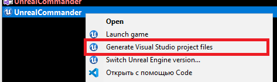
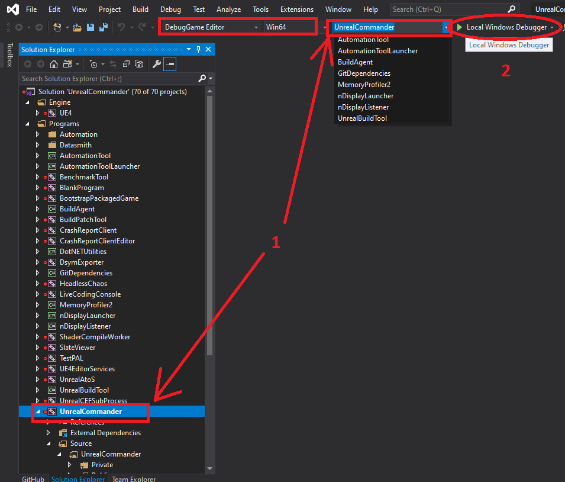
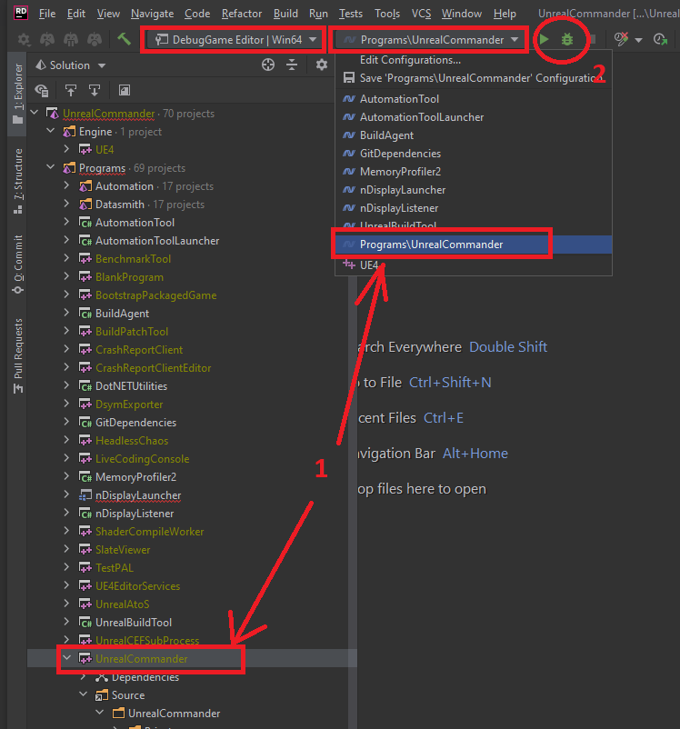
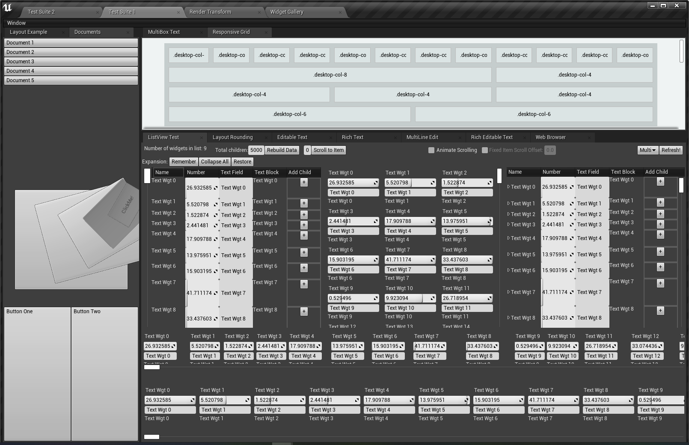

# UnrealCommander

UnrealCommander is an attempt to create a file manager similar to [DoubleCommander](https://doublecmd.sourceforge.io/), based on [SlateUI Framework](https://docs.unrealengine.com/en-US/Programming/Slate/index.html) ([UnrealEngine4](https://www.unrealengine.com/) module), more for educational purposes.

**Contribution is welcome, write to me lpestlname@gmail.com**

## Quick start 

 For a quick start in development, follow these steps:
 1. You need to have access to the `Unreal Engine 4` source code. To do this, follow all the steps described in this guide: https://docs.unrealengine.com/en-US/GettingStarted/DownloadingUnrealEngine/index.html
 2. Build the engine from source by following the instructions in this tutorial:
    * *Windows*: https://docs.unrealengine.com/en-US/Programming/Development/BuildingUnrealEngine/index.html
    * *Linux*: https://docs.unrealengine.com/en-US/Platforms/Linux/BeginnerLinuxDeveloper/SettingUpAnUnrealWorkflow/index.html
3. Clone the `UnrealCommander` source code from this repository to your computer. **WARNING:** Do not use to run `UnrealCommander.uproject` file. In the context of this application (and in general Stand Alone applications), this file is intended for generating a project. 
4. Generate a `UnrealCommander` project for your IDE:
    * *Windows*: It is enough to right-click on the `UnrealCommander.uproject` file and select the `Generate Visual Studio project files` menu item.

    

    * *Linux*: `TODO: write instructions`
5. Run the project in your IDE, set up the appropriate platform, configuration and build target. 
    * Examples:
        * Visual Studio:

        

        * JetBrains Rider for Unreal Engine:

        

        * `TODO: etc.`

6. Compile and run the application. After launching, you should see the basic SlateViewer window.

## Now everything is ready for development. Let's do it!

## TODO:

- [x] Create Stand Alone application based on SlateViewer template;
- [ ] Creating an empty UI shell based on Slate UI Framework and Layout of working areas;
- [ ] ...